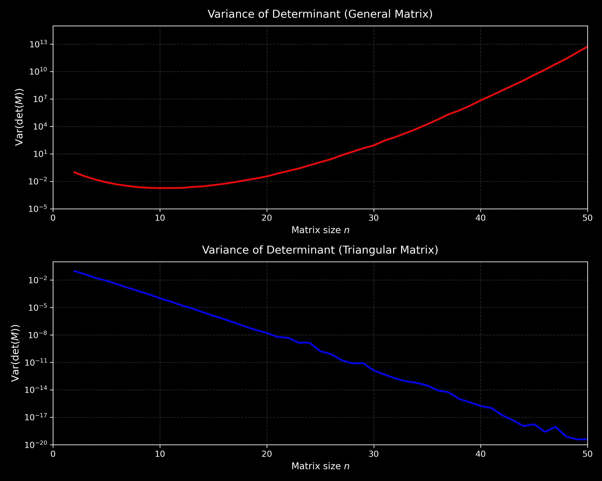

## gitvar
This project looks at the statistical properties of matrix determinants, and the differences that arise in certain matrix types. In particular I analysed the determinants of randomly generated general $n \times n$ matrices and trianglular matrices, looking at the relationship between determinant variance and matrix dimension. I used python to generate the following plots. 

